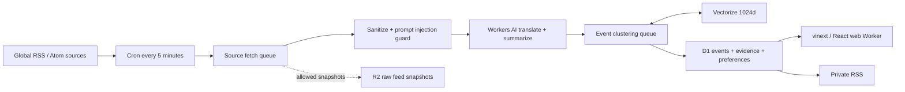

<div align="center">


# PULSE/AI

### 全球 AI 信号，中文抵达。Global AI signals, delivered in Chinese.

[](https://pulse-ai-web.sumerchaser.workers.dev)
[](https://developers.cloudflare.com/workers/)
[](https://nextjs.org/)
[](https://www.typescriptlang.org/)

[打开实时雷达](https://pulse-ai-web.sumerchaser.workers.dev) · [Live Demo](https://pulse-ai-web.sumerchaser.workers.dev) · [中文](#中文) · [English](#english)

</div>

---

## 中文

PULSE/AI 是一个部署在 Cloudflare 全球边缘网络上的个人 AI 情报雷达。它每 5 分钟采集一批可信的全球 AI 来源，自动完成清洗、中文翻译、结构化摘要、证据聚类和个性化排序。

它不想成为另一个无限滚动的 AI 新闻站。它只回答三件事：

1. 刚刚发生了什么？
2. 为什么值得 AI 从业者现在关注？
3. 原始证据在哪里？

### 它有什么用

- **减少信息噪音**：把多篇相关内容聚合为一个事件，而不是重复展示链接。
- **跨语言追踪**：英文和其他语言信号自动生成中文标题、摘要与影响判断，同时保留原文。
- **证据优先**：每条公开事件必须关联可回溯的 HTTPS 原始来源。
- **为你排序**：按主题、公司、人物和关键词调整关注范围，反馈会持久化到 D1。
- **自动运行**：Cron、Queues、Workers AI 和质量门协同工作，不需要人工编辑日报。
- **私有 RSS**：无需邮箱即可生成随机私有订阅地址，网站和 RSS 共用兴趣偏好。

### 已上线能力

| 能力 | 说明 |
| --- | --- |
| 今日信号 | 展示当前最值得关注的真实事件与来源状态 |
| 雷达排序 | 为你精选、正在上升、最新、已确认四种视图 |
| 中文速报 | 把高信号事件压缩为约 5 分钟可读摘要 |
| 事件详情 | 中文解读、原文、推荐依据、新增事实和证据矩阵 |
| 兴趣与反馈 | 关注、收藏、减少此类内容、仅看已核实 |
| 全局搜索 | 搜索事件、公司、人物、主题和原始字段 |
| 私有 RSS | 无邮箱生成，随机令牌，只保存令牌哈希 |
| 分享 | 网站级分享、公开事件页面与 Open Graph 卡片 |
| 自动采集 | Cloudflare Cron 每 5 分钟调度，队列异步处理 |
| 安全质量门 | SSRF 限制、提示注入隔离、Schema 校验、低置信隔离 |

### 当前信号源

首版接入 10 个高信号 HTTPS RSS / Atom 来源：

`OpenAI` · `Google DeepMind` · `AWS Machine Learning` · `GitHub AI & ML` · `GitHub Changelog` · `Cloudflare Blog` · `arXiv cs.AI` · `Apple Machine Learning` · `Vercel Changelog` · `NIST`

来源注册表位于 [`services/radar/src/sources.ts`](./services/radar/src/sources.ts)。新增来源前应确认其使用条款、Feed 政策和快照权限。

### 架构



生产环境由两个 Worker 组成：

- `pulse-ai-web`：网站、用户偏好 API、公开事件页和私有 RSS。
- `pulse-ai-radar`：Cron、采集队列、Workers AI、Vectorize 聚类和数据质量门。

两者绑定同一个 D1 数据库。Radar Worker 还绑定 R2、Vectorize、Workers AI 与四条业务队列。

### 本地运行

要求 Node.js `>= 22.13.0`。

```bash
git clone https://github.com/summerchaserwwz/pulse-ai-radar.git
cd pulse-ai-radar
npm install
cp .dev.vars.example .dev.vars

# 初始化本地 D1
npx wrangler d1 migrations apply pulse-ai --local \
  --config services/radar/wrangler.jsonc

# 启动 Web
npm run dev
```

另开一个终端启动 Radar Worker：

```bash
npx wrangler dev --config services/radar/wrangler.jsonc
```

没有远端 Cloudflare 绑定时，网站会使用带明确标识的历史公开样例，不会把演示数据伪装成实时新闻。

### 部署到 Cloudflare

#### 准备账号

```bash
npx wrangler login
npx wrangler whoami
```

#### 创建资源

```bash
# D1
npx wrangler d1 create pulse-ai

# R2
npx wrangler r2 bucket create pulse-ai-raw

# Vectorize，维度必须与当前 embedding 模型一致
npx wrangler vectorize create pulse-ai-events \
  --dimensions=1024 \
  --metric=cosine

# 业务队列
npx wrangler queues create pulse-ai-source-fetch
npx wrangler queues create pulse-ai-item-enrich
npx wrangler queues create pulse-ai-event-cluster
npx wrangler queues create pulse-ai-delivery

# 死信队列
npx wrangler queues create pulse-ai-source-fetch-dlq
npx wrangler queues create pulse-ai-item-enrich-dlq
npx wrangler queues create pulse-ai-event-cluster-dlq
npx wrangler queues create pulse-ai-delivery-dlq
```

把 `wrangler d1 create` 返回的 `database_id` 同时写入：

- [`wrangler.web.jsonc`](./wrangler.web.jsonc)
- [`services/radar/wrangler.jsonc`](./services/radar/wrangler.jsonc)

两个 Worker 必须绑定同一个 D1。

#### 应用数据库迁移

```bash
npx wrangler d1 migrations apply pulse-ai --remote \
  --config services/radar/wrangler.jsonc
```

迁移文件只增不删，位于 [`drizzle/`](./drizzle)。

#### 配置生产密钥

生成两个随机值：

```bash
openssl rand -hex 32  # AUTH_SIGNING_KEY
openssl rand -hex 24  # CRON_SECRET
```

将网站的最终 HTTPS 地址作为 `APP_ORIGIN`。不要把任何真实值写进仓库。

```bash
# Web Worker
npx wrangler secret put APP_ORIGIN --config wrangler.web.jsonc
npx wrangler secret put AUTH_SIGNING_KEY --config wrangler.web.jsonc

# Radar Worker，同名值必须与 Web 完全一致
npx wrangler secret put APP_ORIGIN --config services/radar/wrangler.jsonc
npx wrangler secret put AUTH_SIGNING_KEY --config services/radar/wrangler.jsonc
npx wrangler secret put CRON_SECRET --config services/radar/wrangler.jsonc
```

PULSE/AI 的默认产品流不需要邮箱或邮件服务。

#### 发布

```bash
# 数据面
npx wrangler deploy --config services/radar/wrangler.jsonc

# 网站
npm run build
npx wrangler deploy --config wrangler.web.jsonc
```

部署后 Cron 会每 5 分钟自动采集。也可以使用 `CRON_SECRET` 手动触发一次调度：

```bash
curl -X POST https://YOUR-RADAR-WORKER.workers.dev/v1/admin/schedule \
  -H "Authorization: Bearer $CRON_SECRET"
```

### 安全与隐私

公开仓库可以安全包含 Worker 名称、binding 名称、来源 URL 和 Cloudflare 资源 ID，它们是标识符，不是访问凭证。

以下内容绝不能提交或公开：

- `CLOUDFLARE_API_TOKEN`
- `AUTH_SIGNING_KEY`
- `CRON_SECRET`
- `.env`、`.dev.vars` 和本地 Wrangler 状态
- 用户生成的完整 `/rss.xml?token=...` 地址

项目默认忽略 `.env*`、`.wrangler/`、证书和构建产物。RSS 使用 64 位随机十六进制令牌，D1 只保存 SHA-256 哈希；界面不会向其他访客公开你的 RSS 地址。

`.dev.vars.example` 只包含本地占位值。生产环境必须重新生成密钥，不能复用示例内容。

所有外部 Feed 都被当作不可信输入：只允许注册表中的 HTTPS host，限制响应大小与跳转，清理 HTML，检测提示注入，并校验 Workers AI 的结构化 JSON 输出。低置信或异常内容进入隔离区，不进入公开信息流。

### 项目结构

```text
app/                    vinext 页面、网站 API、公开事件页、RSS
services/radar/         Cloudflare Radar Worker 与采集流水线
shared/                 信号类型、演示数据与个性化排序
db/                     Drizzle schema
drizzle/                D1 只增不删迁移
tests/                  SSR、API、RSS、迁移和数据层测试
wrangler.web.jsonc      Web Worker 配置
services/radar/wrangler.jsonc
                        Radar Worker 配置
```

### 验证

```bash
npm run lint
npm test
```

测试覆盖 URL 归一化、来源 allowlist、提示注入、AI Schema、事件聚类、D1 幂等、公开页面、匿名偏好和无邮箱 RSS。

### 许可

当前仓库尚未附加开源 LICENSE。源码公开可读，但不自动授予复制、修改或分发权。如需开放复用，请由项目所有者选择 MIT、Apache-2.0 或其他合适许可证。

### 下一步

- 将来源扩展到 100-300 个官方、研究、GitHub、Hugging Face、Reddit 与 YouTube 信号源。
- 增加快速捕捉层与官方验证层，区分“刚发生”和“已确认”。
- 用跨平台提及增长计算真实 velocity，而不是只看证据数量。
- 为完整历史增加游标分页与事件演进时间线。
- 增加来源健康、失败率和数据新鲜度面板。

---

## English

PULSE/AI is a personal AI intelligence radar running on Cloudflare's global edge. Every five minutes it collects trusted AI feeds, sanitizes untrusted input, translates global signals into Chinese, generates structured summaries, clusters related evidence, and ranks the result around each reader's interests.

It is not another infinite AI news feed. It is designed to answer three questions:

1. What just changed?
2. Why should an AI practitioner care now?
3. Where is the original evidence?

### Why it exists

- **Less noise**: related posts become one evolving event instead of repeated links.
- **Cross-language awareness**: Chinese titles, summaries, and impact analysis with the original text preserved.
- **Evidence first**: every public event links back to traceable HTTPS sources.
- **Personal ranking**: topics, companies, people, keywords, follows, bookmarks, and negative feedback shape the feed.
- **Fully automated**: Cron, Queues, Workers AI, Vectorize, and deterministic quality gates run without an editor.
- **Private RSS**: generate a tokenized feed without providing an email address.

### Production features

| Feature | What it does |
| --- | --- |
| Today | High-signal events with live pipeline and evidence status |
| Radar | For you, rising, latest, and confirmed views |
| Briefing | A five-minute personalized summary of the day's changes |
| Event pages | Chinese analysis, original text, new facts, and source matrix |
| Preferences | Interests, follows, bookmarks, less-like-this, verified-only |
| Search | Events, companies, people, topics, and original fields |
| Private RSS | Email-free generation, random token, hash-only storage |
| Sharing | Native site sharing, public event URLs, and Open Graph cards |
| Automation | Five-minute Cloudflare Cron with asynchronous queue stages |
| Safety | SSRF controls, prompt-injection quarantine, schema validation |

### Stack

- Next.js 16 + React 19, built for Cloudflare with vinext
- Cloudflare Workers + Cron Triggers + Queues
- D1 for events, evidence, preferences, and anonymous identities
- Workers AI for Chinese translation and structured summaries
- Vectorize for 1024-dimensional semantic event candidates
- R2 for explicitly allowed raw feed snapshots
- Geist + Phosphor Icons + a custom editorial intelligence UI

### Quick start

```bash
git clone https://github.com/summerchaserwwz/pulse-ai-radar.git
cd pulse-ai-radar
npm install
cp .dev.vars.example .dev.vars
npx wrangler d1 migrations apply pulse-ai --local \
  --config services/radar/wrangler.jsonc
npm run dev
```

Run the radar worker in another terminal:

```bash
npx wrangler dev --config services/radar/wrangler.jsonc
```

### Deploy

The complete Cloudflare provisioning guide is in the [Chinese deployment section](#部署到-cloudflare). In short:

1. Create D1, R2, a 1024d Vectorize index, four queues, and four DLQs.
2. Put the same D1 `database_id` in both Wrangler configurations.
3. Apply all remote D1 migrations.
4. Configure matching `APP_ORIGIN` and `AUTH_SIGNING_KEY` secrets on both Workers.
5. Configure `CRON_SECRET` on the Radar Worker.
6. Deploy Radar, build the web app, then deploy Web.

No email provider is required for the default PULSE/AI product flow.

### Public repository safety

No production secret belongs in Git. Cloudflare resource IDs, Worker names, binding names, and source URLs are identifiers, not credentials. Keep API tokens, signing keys, Cron secrets, `.env` files, Wrangler state, and private RSS URLs out of the repository.

Before publishing changes, run:

```bash
npm run lint
npm test
git diff --check
```

### License status

This repository does not currently include an open-source license. The source is publicly readable, but reuse, modification, and redistribution are not automatically granted until the owner selects a license.

### Live site

The public production radar is available at:

**https://pulse-ai-web.sumerchaser.workers.dev**

---

<div align="center">

Built for people who need signal, not another feed.

[Open PULSE/AI](https://pulse-ai-web.sumerchaser.workers.dev)

</div>
