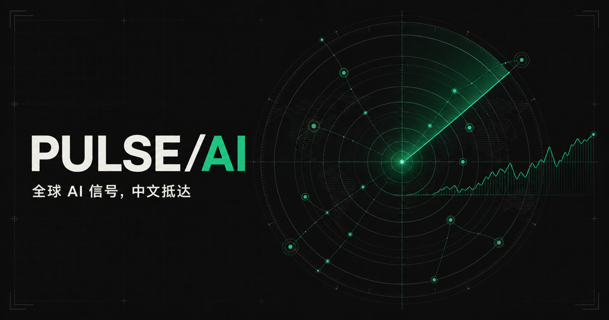
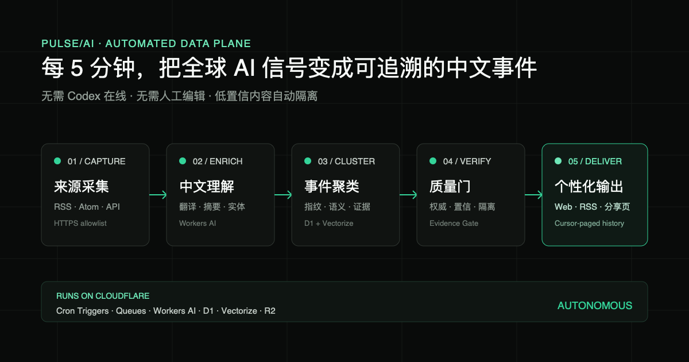
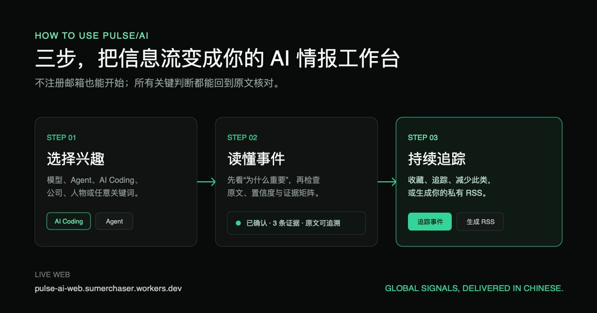
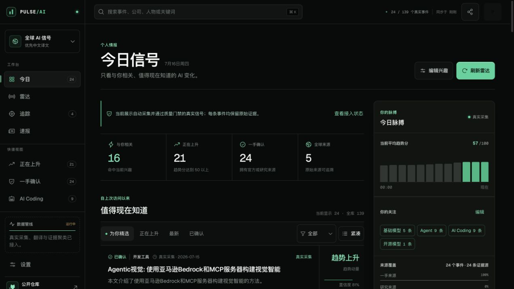
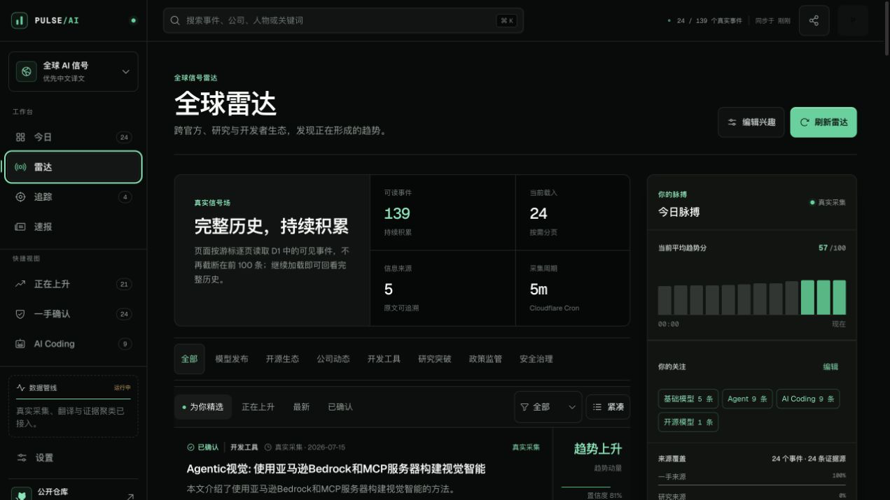

# 我做了一个 AI 情报雷达：全球信号，自动翻成中文



每天都有新模型、新论文、新工具、新政策。

真正让人疲惫的，不是信息少，而是信息散：官网一条、GitHub 一条、论文一条，社交平台又转述十几遍。收藏夹越来越满，真正影响工作的变化却可能被错过。

所以我做了 **PULSE/AI**。它不是另一个 AI 新闻列表，而是一套自动运行的个人情报雷达：定时采集可信来源，把英文内容翻成中文，把相关证据合并成事件，再告诉你——**发生了什么，为什么重要，原文在哪里。**

在线地址：<https://pulse-ai-web.sumerchaser.workers.dev>

开源仓库：<https://github.com/summerchaserwwz/pulse-ai-radar>

## 它解决的不是“没新闻”，而是三个更实际的问题

### 1. 信息太多，但真正值得看的太少

普通信息流把每个链接都当成一条内容。同一件事，官网、博客、论文和代码仓库会重复出现。

PULSE/AI 会先去重，再做事件聚类。相关内容尽量合并到同一个事件下面，读者看到的是“这件事发生了什么”，而不是一排相似标题。

### 2. 中文摘要很方便，但不能只相信摘要

AI 自动总结最大的风险，是读起来顺，却不知道依据是什么。

所以每条公开事件都保留原始来源。详情页里可以同时看到中文标题、中文摘要、原文、置信度和证据矩阵。觉得某个判断有问题，直接回到原文核对。

### 3. 热点不等于与你有关

做 AI 产品、模型研究、开发工具和政策合规的人，关注点完全不同。

你可以选择基础模型、Agent、AI Coding、开源模型、多模态、安全治理等主题，也可以直接添加公司、人物或关键词。系统会根据兴趣、收藏、追踪和“少看此类”反馈重新排序。

> 真正有用的雷达，不是告诉所有人同一批热点，而是减少与你无关的信息。

## 它是怎么自动运行的



整套系统部署在 Cloudflare 上，不依赖 Codex 在线，也不需要我的电脑开着。

每 5 分钟，Cloudflare Cron 会触发一次采集：

1. 从登记好的 HTTPS RSS / Atom 来源读取内容；
2. 清理 HTML、限制跳转与响应大小，并检查提示注入；
3. 用 Workers AI 完成中文翻译、摘要、实体和主题提取；
4. 用指纹和 Vectorize 判断是否属于已有事件；
5. 根据来源权威度、多源证据、置信度和时间计算排序；
6. 合格内容写入 D1，异常或低置信内容进入隔离区。

目前接入了 10 个首批来源，包括 OpenAI、Google DeepMind、AWS Machine Learning、GitHub、Cloudflare、arXiv、Apple ML、Vercel 和 NIST。

在 2026 年 7 月 16 日的生产检查中，D1 已累计 240 条事件，其中 139 条通过当前质量门并可公开读取。这个数字会继续增加。

以前页面接口只显示前 100 条。现在已经改成游标分页：每次读取一小页，保持速度；用户可以一直加载到历史尽头。**单页有限制，全库没有 100 条上限。**

这里也要说清楚：当前属于“5 分钟级准实时”。如果来源自己晚半小时才更新 RSS，雷达也只能在 RSS 出现后发现。它暂时还不是 X、Reddit 那种秒级社交趋势监控。

## 怎么用：三步就够了



### 第一步：选择你真正关心的方向

打开“设置”，选择主题，或者输入公司、人物和关键词。

例如：

- Anthropic
- AI Coding
- 推理成本
- 开源模型
- AI 安全

这些兴趣会同时影响网站排序和私有 RSS。

### 第二步：先看“为什么重要”，再看证据

我把事件卡片分成几层：

- 标题和摘要：快速了解发生了什么；
- 为什么重要：判断是否值得继续读；
- 状态和置信度：了解系统有多确定；
- 来源矩阵：回到官网、论文或仓库核对。



如果只想扫一遍，可以打开“五分钟速报”；如果想研究某个变化，就进入事件详情看原文和证据。

### 第三步：收藏、追踪，或者生成 RSS

看到值得持续关注的事件，可以加入追踪。觉得某类内容没价值，可以选择“少看此类”。

不想每天打开网站，也可以直接生成私有 RSS。这个流程不要求邮箱，D1 只保存令牌哈希，不会公开你的完整订阅地址。

## 这版界面，我刻意少做了几件事



这次界面参考了 Linear 一类开发者工具的设计方法：近黑画布、细边框、紧凑密度和单一 emerald 强调色。

但真正重要的不是“像谁”，而是减法：

- 不做花哨的营销首页，打开就是工作台；
- 不用大面积渐变抢注意力；
- 不让装饰性图表冒充真实数据；
- 不把设置堆在主流程里；
- 提高正文和元信息字号，保证移动端也能快速扫读。

雷达页原先有一个动态扫描图，看起来像雷达，但不能表达真实数据。这次直接换成了四个明确数字：可读事件、当前载入、信息来源和采集周期。

## 谁会用得上

我觉得它更适合下面几类人：

- 需要跟进模型、Agent、AI Coding 的开发者；
- 需要快速判断产品机会的 AI 产品经理；
- 关注论文、开源模型和工程实现的研究人员；
- 需要追踪政策、安全和行业变化的从业者；
- 想搭建自己信息雷达，而不是订阅又一份通用日报的人。

它不适合把所有社交热点一网打尽。目前的优势是证据严格、中文友好、可以自己部署；不足是来源数量仍少，社交传播速度也还没有纳入真正的 velocity 计算。

## 想自己部署，也可以

项目已经公开在 GitHub，默认产品流不需要邮件服务。

```bash
git clone https://github.com/summerchaserwwz/pulse-ai-radar.git
cd pulse-ai-radar
npm install
cp .dev.vars.example .dev.vars
npm run dev
```

生产环境使用两个 Cloudflare Worker：一个负责网站和 API，一个负责 Cron、Queues、Workers AI、Vectorize 与质量门。仓库 README 里写了完整的 D1、R2、Vectorize、Queues 和 Secret 配置步骤。

下一步，我准备继续扩展 GitHub Releases、Hugging Face、YouTube、Reddit 等来源，同时把“刚刚出现”和“官方确认”拆成两条独立信息流。

如果你每天也被 AI 信息淹没，欢迎试试 PULSE/AI。你最希望它新增哪个信息源？

---

## 备选标题

1. **我做了一个 AI 情报雷达：全球信号，自动翻成中文**
2. **别再刷十个网站了，我把 AI 情报做成了自动雷达**
3. **PULSE/AI 使用指南：5 分钟级全球 AI 中文雷达**

## 分享摘要

PULSE/AI 每 5 分钟自动采集可信 AI 来源，完成中文翻译、事件聚类、质量检查和个性化排序，并保留原文证据。网站和私有 RSS 均可直接使用。

## 配图清单

1. 封面：`public/og.png`，1200 × 630
2. 自动采集管线：`docs/assets/pulse-ai-pipeline.png`，1200 × 630
3. 三步使用指南：`docs/assets/pulse-ai-how-to.png`，1200 × 630
4. 今日信号截图：`docs/assets/pulse-ai-today.png`
5. 全球雷达截图：`docs/assets/pulse-ai-radar.png`

## 发布建议

- 推荐时间：工作日 08:00–09:00，或 20:00–21:30
- 推荐摘要关键词：AI 情报、AI 工具、Cloudflare、RSS、中文翻译
- 评论区话题：你最希望接入哪个 AI 信息源？你更在意“速度”还是“可信度”？
